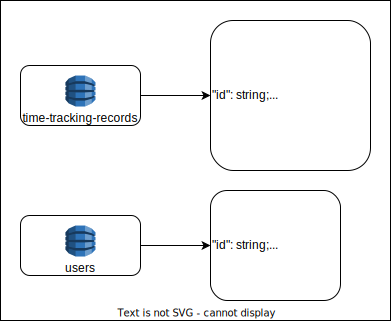

# time-tracking-service

This is a simple time tracking system designed to help employees to view their worked hours, using Clean Architecture, TDD and BDD concepts and [SonarCloud Integration](#sonar).

---


<!-- --- -->
<!-- 


 -->

---


---


---

<a name="table-of-contents"></a>

## Table of contents

* [General Info](#table-of-contents)
    <!-- * [RIPD](#ripd) -->
    <!-- * [Usage Video](#video) -->
* [Usage documentation](#table-of-contents)
    * [Envs](#envs)
    * [Usage with Docker](#table-of-contents)
        * [Prerequisites](#docker-prerequisites)
        * [Usage](#docker-usage)
    * [Usage with Node.JS](#table-of-contents)
        * [Prerequisites](#node-prerequisites)
        * [Installation](#node-installation)
        * [Usage](#node-usage)
        * [Tests](#tests)
    * [Endpoints Rules](#endpoints-rules)
    * [Postman Collection](#postman)
* [Architecture documentation](#table-of-contents)
    * [Solution](#solution)
    * [Next steps](#next-steps)
    * [Database](#database)
    * [Folder Structure](#folder-structure)

---

<a name="ripd"></a>

### RIPD

You can find our RIPD (Relatório de Impacto dos Dados Pessoais) [here](https://docs.google.com/document/d/1Mw-uWwYO-TxTC0RA1C6AxOLVbDg2zWRdSmP78c5ysr8/edit?usp=sharing).

([Back to Table of contents](#table-of-contents) :arrow_up:)

---

<a name="video"></a>

### Usage Video

You can find an explanatory video playlist about how the entire application works [here](https://www.youtube.com/watch?v=jbczUd8j2iI&list=PLYCTn1Be4VEZDL9zT4IxJKcw5vP9bnVRk).

([Back to Table of contents](#table-of-contents) :arrow_up:)

---

<a name="envs"></a>

### Envs

You must configure **.env** file following the [.env.example](/.env.example) template.
Some envs come directly from the [AWS Parameter Store](https://docs.aws.amazon.com/pt_br/systems-manager/latest/userguide/systems-manager-parameter-store.html), so it is very important to have configured the **AWS_ACCESS_KEY_ID** and **AWS_SECRET_ACCESS_KEY** values ​​so that all application envs are loaded correctly.

([Back to Table of contents](#table-of-contents) :arrow_up:)

---

<a name="docker-prerequisites"></a>

## Docker Prerequisites

To run this project with docker, ensure that you have the following items:

* [Docker](https://www.docker.com/)
* [Configured .env file](#envs)

([Back to Table of contents](#table-of-contents) :arrow_up:)

---

<a name="docker-usage"></a>

## Docker Usage

Start the node server with the following commands:

```shell
docker compose build
```

```shell
docker compose up -d
```

([Back to Table of contents](#table-of-contents) :arrow_up:)

---

<a name="node-prerequisites"></a>

## Node Prerequisites

To run this project, ensure that you have the following items:

* [Node.JS](https://nodejs.org) (v20.9.0)
* [Configured .env file](#envs)

([Back to Table of contents](#table-of-contents) :arrow_up:)

---

<a name="node-installation"></a>

## Node Installation

1. Clone this repository to your local machine or download the source code.
2. Open a terminal and navigate to the project's root directory.
3. Run the following command to install the project dependencies:

   ```shell
   npm install
   ```

([Back to Table of contents](#table-of-contents) :arrow_up:)

---

<a name="node-usage"></a>

## Node Usage

Start the node server in developer mode with the following command:

```shell
npm run start:dev
```

This will start the server and watch for any file changes, automatically restarting the server when necessary.

Or start in production mode with the following command:

```shell
npm run start
```

([Back to Table of contents](#table-of-contents) :arrow_up:)

---

<a name="tests"></a>

## Tests

* Run the following command to execute the project tests:

    ```shell
    npm run test
    ```

([Back to Table of contents](#table-of-contents) :arrow_up:)

---

<a name="endpoints-rules"></a>

## Endpoints rules

* All endpoints can be found [here](https://documenter.getpostman.com/view/10486183/2s9YsQ7Ugr).
* Except healthcheck, all endpoints have the prefix `/api` followed by the route version, for example `/api/v1/`.
* All endpoints require authorization, which can be passed through the `Authorization` header with a valid **JWT token** (this can be obtained by making a **POST** request on the login route with username and password).
* The `Authorization` header is an `Bearer Token`.

([Back to Table of contents](#table-of-contents) :arrow_up:)

---

<a name="postman"></a>

## Postman

* [Online Collection](https://documenter.getpostman.com/view/10486183/2s9YsQ7Ugr)

* [Download Collection](docs/rural-producer-service.postman_collection.json "Collection")

([Back to Table of contents](#table-of-contents) :arrow_up:)

---

<a name="solution"></a>

## Solution


([Back to Table of contents](#table-of-contents) :arrow_up:)

---

<a name="next-steps"></a>

## Next Steps


([Back to Table of contents](#table-of-contents) :arrow_up:)

---

<a name="database"></a>

## Database
We use **DynamoDB**. Schemas:



([Back to Table of contents](#table-of-contents) :arrow_up:)

---

<a name="folder-structure"></a>

## Folder Structure

* `.github`: github actions.
* `.vscode`: vscode configs.
* `docs`: all project documentations, like scripts, diagrams, texts.
* `src`
  * `config`: generic project configurations, like database configs, commit configs.
    * `database`: database configs.
      * `models`: database models.
      * `migrations`: database migrations.
    * `envs`: local and async envs configs.
  * `controllers`: application controllers.
  * `dtos`: application dtos.
  * `entities`: application domain entities.
  * `factories`: application factories to be used on routes.
  * `interfaces`: application interfaces.
  * `middlewares`: application middlewares.
  * `repositories`: application repositories.
  * `routes`: application routes.
    * `v1`: v1 endpoints.
  * `services`: application services.
  * `use-cases`: application use cases that contain the entire business rule.
  * `utils`: common utils functions, constants, and application dependencies.
    * `logger`: logger module.
* `tests`: project tests
    * `bdd`: bdd tests

([Back to Table of contents](#table-of-contents) :arrow_up:)
